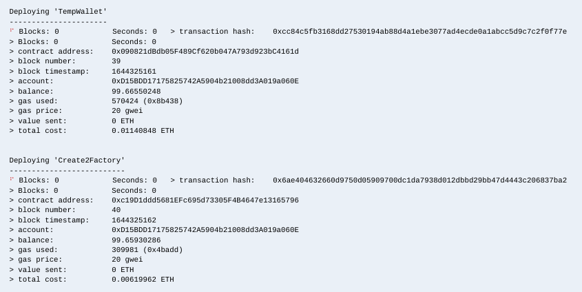
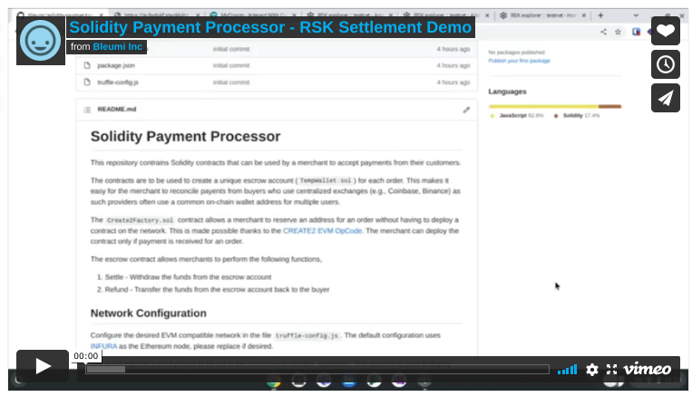
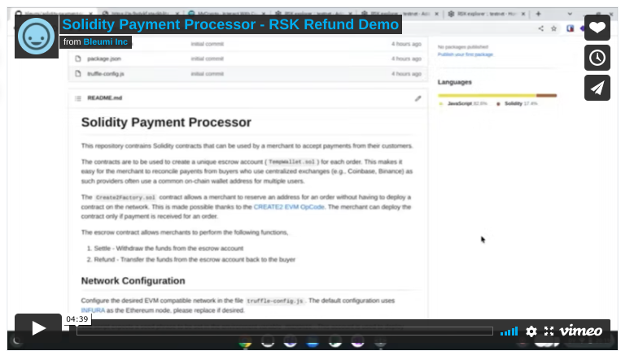

# Solidity Payment Processor

This repository contrains Solidity contracts that can be used by a merchant to accept payments from their customers.

The contracts are to be used to create a unique escrow account (`TempWallet.sol`) for each order. This makes it easy for the merchant to reconcile payents from buyers who use centralized exchanges (e.g., Coinbase, Binance) as such providers often use a common on-chain wallet address for multiple users.

The `Create2Factory.sol` contract allows a merchant to reserve an address for an order without having to deploy a contract on the network. This is made possible thanks to the [CREATE2 EVM OpCode](https://eips.ethereum.org/EIPS/eip-1014). The merchant can deploy the contract only if payment is received for an order.

The escrow contract allows merchants to perform the following functions,
1. Settle - Withdraw the funds from the escrow account
1. Refund - Transfer the funds from the escrow account back to the buyer

## Network Configuration

Configure the desired EVM compatible network in the file `truffle-config.js`. The default configuration uses [INFURA](https://infura.io/) as the Ethereum node, please replace if desired.

The script expects a seed phrase to be set in the environment variable `MNEMONIC`. This account is used to deploy contracts to the network.

## Deployment

Run the following command to deploy the contracts to the specified network

```
$ truffle migrate --network <network>
```

Make a note of the contract address of the Escrow Wallet Library (`'TempWallet'`) & Factory Library (`'Create2Factory'`).



## Sample Payment Flow

**Step 1:** Customer places an order on an eCommerce store and provides their wallet address.

**Step 2:** The eCommerce store assigns a unique order id. A random string of 32 bytes needs to be generated and associated with the order. This value should come from a cryptographically secure pseudorandom number generator as the unique wallet address for the order is devired from this.

The following sample Node.js code uses the `crytpo` module to generate an appropriate salt,
```js
const getSalt = async function () {
    let salt = await crypto.randomBytes(32)
    return '0x' + salt.toString('hex')
}
```

**Step 3:** The eCommerce store will derive a unique escrow address. For ease of use, one may also use the `computeAddress` view function on `Create2Factory.sol`. The following JavaScript code can be used as a reference. A live demo of the code is available at [https://stackblitz.com/edit/js-9vdykf?file=index.js](https://stackblitz.com/edit/js-9vdykf?file=index.js).

```js
(function () {
  const { ethers } = require('ethers');

  const getSalt = async function () {
    const array = new Uint32Array(32);
    self.crypto.getRandomValues(array);

    return `0x` + Buffer.from(array).toString('hex');
  };

  const generate = async function () {
    try {
      const salt = await getSalt();
      document.getElementById('salt').value = salt;

      const merchant = document.getElementById('merchant');
      if (!ethers.utils.isAddress(merchant.value)) {
        return alert(`${merchant.value} is not a valid Address`);
      }

      const buyer = document.getElementById('buyer');
      if (!ethers.utils.isAddress(buyer.value)) {
        return alert(`${buyer.value} is not a valid Address`);
      }

      let args = [
        // Set 0x01 at address 0 (Reentrancy Guard)
        '6000600155',
        // Set merchant as accounts[1] (Constructor Arg 1)
        `73${merchant.value.toLowerCase().substring(2)}600155`,
        // Set buyer as accounts[2] (Constructor Arg 2)
        `73${buyer.value.toLowerCase().substring(2)}600255`,
      ].join('');

      // Static 10 is for EIP 1167 (3d60<size>8060563d3981f3)
      let runtimeOffset = (args.length / 2 + 10).toString(16);
      if (runtimeOffset.length === 1) {
        runtimeOffset = '0' + runtimeOffset;
      }

      const escrowlib = document.getElementById('escrowlib');
      if (!ethers.utils.isAddress(escrowlib.value)) {
        return alert(`${escrowlib.value} is not a valid Address`);
      }

      const bytes =
        '0x' +
        [
          args,
          // EIP 1167 with TempWalletI
          `3d602d8060${runtimeOffset}3d3981f3363d3d373d3d3d363d`,
          `73${escrowlib.value.toLowerCase().substring(2)}`,
          '5af43d82803e903d91602b57fd5bf3',
        ].join('');

      const hash = ethers.utils.keccak256(bytes);

      const factory = document.getElementById('factory').value;
      if (!ethers.utils.isAddress(factory.value)) {
        return alert(`${factory.value} is not a valid Address`);
      }

      const addr = ethers.utils.getCreate2Address(
        factory.value.toLowerCase(),
        salt,
        hash
      );

      document.getElementById('escrow').value = addr;
    } catch (err) {
      console.error(err);
    }
  };

  const form = document.getElementById('form');
  form.addEventListener('submit', function (event) {
    generate();

    event.preventDefault();
  });
})();
```

**Step 4:** The customer transfers the specified token into the unique escrow for the order.

**Step 5:** The eCommerce store confirms the payment transaction and completes the order. The user is then redirected to the order completed page.

**Step 6:** The eCommerce store deploys the contract byte code and calls the `settle` or `settleETH` function to withdraw the funds.

## Demo

### ERC20 Settlement on RSK Testnet

[](https://vimeo.com/674894504)

* Factory Library (`Create2Factory.sol`): [0x9eC91054d180edcde59713f9740aFF6e90c254eA](https://explorer.testnet.rsk.co/address/0x9eC91054d180edcde59713f9740aFF6e90c254eA)
* Escrow Wallet Library (`TempWallet.sol`): [0xb18e6f6da182eb3767f44ee47dcaa400f2499467](https://explorer.testnet.rsk.co/address/0xb18e6f6da182eb3767f44ee47dcaa400f2499467)
* Merchant Wallet: [0x9266095d58cdd9c4e0c4414c3bdd2bbeb28d650c](https://explorer.testnet.rsk.co/address/0x9266095d58cdd9c4e0c4414c3bdd2bbeb28d650c)
* Customer Wallet: [0x0cb6f44c1849fc2aec2a41c3912c0c19e4649915](https://explorer.testnet.rsk.co/address/0x0cb6f44c1849fc2aec2a41c3912c0c19e4649915)
* Escrow Wallet: [0xe97d5cf63d4f46842b2b3850c6ed2e49ad044c34](https://explorer.testnet.rsk.co/address/0xe97d5cf63d4f46842b2b3850c6ed2e49ad044c34?__tab=tokens%20transfers)
* 10 USD Payment Tx: [0x1888e58a928c5008a6a2c1de71e19d2884f523cf9f19d0e4e202e8c4ea668cb5](https://explorer.testnet.rsk.co/tx/0x1888e58a928c5008a6a2c1de71e19d2884f523cf9f19d0e4e202e8c4ea668cb5?__ctab=Token%20Transfers)
* 10 USD Settlement Tx: [0xb6cd91329828c400c3f2f06486efb5e4ae99e01b1967004a01c338a97145b422](https://explorer.testnet.rsk.co/tx/0xb6cd91329828c400c3f2f06486efb5e4ae99e01b1967004a01c338a97145b422?__ctab=Token%20Transfers)

### ERC20 Refund on RSK Testnet

[](https://vimeo.com/674895232)

* Factory Library (`Create2Factory.sol`): [0x9eC91054d180edcde59713f9740aFF6e90c254eA](https://explorer.testnet.rsk.co/address/0x9eC91054d180edcde59713f9740aFF6e90c254eA)
* Escrow Wallet Library (`TempWallet.sol`): [0xb18e6f6da182eb3767f44ee47dcaa400f2499467](https://explorer.testnet.rsk.co/address/0xb18e6f6da182eb3767f44ee47dcaa400f2499467)
* Merchant Wallet: [0x9266095d58cdd9c4e0c4414c3bdd2bbeb28d650c](https://explorer.testnet.rsk.co/address/0x9266095d58cdd9c4e0c4414c3bdd2bbeb28d650c)
* Customer Wallet: [0x0cb6f44c1849fc2aec2a41c3912c0c19e4649915](https://explorer.testnet.rsk.co/address/0x0cb6f44c1849fc2aec2a41c3912c0c19e4649915)
* Escrow Wallet: [0xc3c2ea927d6d8efa5218e7f4820d051d6a9c12e8](https://explorer.testnet.rsk.co/address/0xc3c2ea927d6d8efa5218e7f4820d051d6a9c12e8?__tab=tokens%20transfers)
* 11 USD Payment Tx: [0xd9f27012966dca0dad839c44fc4b57d3289ed157178d78bd85a28549154277cf](https://explorer.testnet.rsk.co/tx/0xd9f27012966dca0dad839c44fc4b57d3289ed157178d78bd85a28549154277cf?__ctab=Token%20Transfers)
* 11 USD Refund Tx: [0x0328a4a85b2d852381786df8a9d04b8f97d41dc20c80734fb5645c5184e82cff](https://explorer.testnet.rsk.co/tx/0x0328a4a85b2d852381786df8a9d04b8f97d41dc20c80734fb5645c5184e82cff?__ctab=Token%20Transfers)
